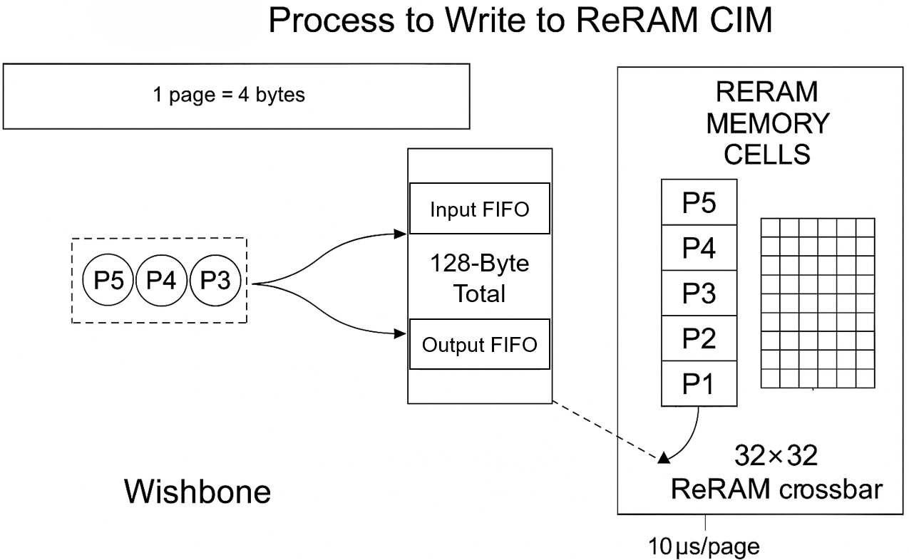

<table>
  <tr>
    <td align="center"></td>
    <td align="center"></td>
  </tr>
</table>

# Neuromorphic X1 – Analog In-Memory Compute IP Macro

Neuromorphic X1 is a **compact, ultra-efficient analog in-memory compute (AiMC) IP macro** featuring a **32 × 32 1T1R crossbar** for low-power matrix operations—ideal for edge AI and embedded IoT deployments.  
[View Product Page](https://bmsemi.io/commercial-neuromorphic-x1.html)

---

## 🔹 Key Features
- **Analog in-memory MAC engine** in a 32 × 32 1T1R array  
- Drop-in, licenseable macro for energy-efficient computation at the edge  
- Designed for embedded / IoT AI where **energy** and **latency** are critical

---

## 📑 Summary
Neuromorphic X1 brings **in-memory compute** to compact silicon form factors, reducing data movement and significantly lowering power consumption for AI workloads.  
It is optimized for:
- Always-on AI (keyword spotting, anomaly detection)
- Edge AI in battery-powered devices
- Low-latency on-device processing

**At a glance:**
- **Architecture:** 32 × 32 1T1R analog crossbar  
- **Compute Type:** Multiply–Accumulate (MAC) in crossbar array  
- **Target Applications:** TinyML, sensing, embedded AI inference  
- **Benefits:** High energy efficiency, low latency, small area footprint

## 📷 Process to Write to ReRAM CIM

**Figure Explanation:**  
This diagram illustrates the **data write process** to the Neuromorphic X1’s **32×32 ReRAM crossbar** via a **Wishbone interface**.  
- **1 page = 4 bytes** (one wordline)  
- Data packets (P1–P5) are transferred from the Wishbone bus to the **page buffer**  
- From the buffer, data is written into the corresponding rows and columns of the ReRAM crossbar  
- Each write cycle takes approximately **10 µs per page**, enabling fast updates while maintaining energy efficiency

---

**Source:** [Neuromorphic X1 – bmsemi.io](https://bmsemi.io/commercial-neuromorphic-x1.html)
